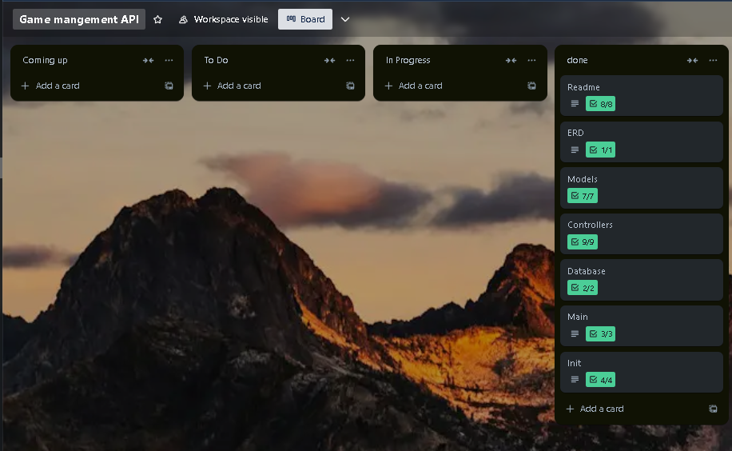

# LukeHarris-T2A2

## R1
- Explain the problem that this app will solve, and explain how this app solves or addresses the problem.

### Problem Statement
Gamers expect a seamless and engaging experience while tracking their progress, achievements, and gameplay. However, many games lack an integrated system that facilitates managing user accounts, gaming sessions, achievements, leaderboards, and other critical elements. This can lead to several issues:

1. **User Management**: Many games require players to manage multiple accounts across different platforms, resulting in a disjoint experience. Without a centralised system, retrieving user data across platforms becomes annoying.

2. **Achievement Tracking**: Without an achievement system, players often miss out on feeling accomplished, which can lead to decreased engagement and motivation. Players want something to encourage them to explore and engage with the game.

3. **Session Management**: Players increasingly participate in multiplayer and online sessions that require consistent tracking and management. However, many games do not offer features to monitor sessions effectively.

4. **Data Analysis**: Game developers need insight into popular genres, and session times to refine gameplay. Without a unified API for data management, analysing this data becomes challenging and time-consuming.

### Solution

The **Gaming Management API** addresses these issues by providing a robust and comprehensive backend system that centralises user management, session tracking, and achievement systems while optimising the gaming experience.

1. **Centralised User Management**: Through the API, players can create accounts, log in, and manage their profiles in one location. This facilitates single-sign-on access to different games and platforms, creating a seamless experience.

2. **Achievement Tracking**: The API includes an achievements system where users can earn and track various achievements across different games. Developers can leverage this feature to create engaging gameplay mechanics that encourage players to complete specific tasks, enhancing retention rates.

3. **Session Management**: The session management feature allows players to start and track their gaming sessions efficiently. It facilitates actions like saving active game sessions, allowing for smoother transitions in multiplayer settings, and improving the overall player experience.

4. **Data Analysis and Insights**: By collecting gameplay metrics like session durations, scores, and achievement completions through the API, developers gain valuable insights into player behavior. This data can inform updates and marketing strategies, aligning game development with player preferences and improving overall engagement.

### Impact

By implementing this API, a development team can create games that not only engage players but also build a strong community through shared achievements and streamlined gameplay. The centralised structure fosters player loyalty and satisfaction, ultimately contributing to increased player retention and game success.

## R2
- Describe the way tasks are allocated and tracked in your project.

### Trello Implementation

I used **Trello** as my task management tool. 

1. **Board Structure**:
   - I created a **Trello board** for the Game Management API project. The board was broken down into several lists:
     - **Coming-up**: A list of all tasks to be done after current to-do.
     - **To Do**: Tasks that are set to be done next. 
     - **In Progress**: Tasks currently being worked on.
     - **Done**: Completed tasks.

2. **Task Cards**:
Each task card had these details:
   - **Title**: A description of the task.
   - **Checklists**: Checklists were included to break down subtasks.
   - **priority**: Set priority (High, Medium, Low)
   
3. **Assignment of Tasks**:
   - I would select tasks from the **Coming-up** and move them to the **To Do** list. Based on the priority I had set.
   - I updated the status of tasks by moving the cards from one list to another as i progressed through.
----
1. **Trello At the beginning**  


2. **Trello at mid way point**  


3. **Trello Almost complete**  


4. **Trello complete**  


5. **Trello Readme**  


6. **Trello database**  


7. **Trello main**  


8. **Trello init**  


9. **Trello models**  


10. **Trello controllers**  


11. **Trello ERD**  


## R3
- List and explain the third-party services, packages and dependencies used in this app.

## Third-Party Services, Packages, and Dependencies

My **Game Management API** uses a few third-party services and packages to provide a better and more efficient backend for game management.

1. **Flask**
   - **Description**: Flask is a lightweight and flexible web framework for Python. It is designed to make creating web applications simple and fast, providing a minimalistic approach to routing and request handling.
   - **Usage**: In this application, Flask serves as the backbone for the API, handling incoming HTTP requests and routing them to the appropriate controllers.

2. **Flask-SQLAlchemy**
   - **Description**: Flask-SQLAlchemy is an extension for Flask that simplifies the use of SQLAlchemy, which is an ORM (Object-Relational Mapping) library for SQL databases.
   - **Usage**: It allows for easy manipulation of the database through Python classes, enabling model creation, querying, and data persistence without writing raw SQL queries.

3. **Flask-Marshmallow**
   - **Description**: Flask-Marshmallow integrates the Marshmallow library with Flask, which is used for serialization and deserialization of complex data types.
   - **Usage**: It simplifies the process of converting Python objects (like ORM models) to JSON and vice versa, making it easier to validate input data received from API requests.

4. **Flask-Bcrypt**
   - **Description**: Flask-Bcrypt is an extension that provides BCrypt hashing utilities to Flask applications for hashing passwords securely.
   - **Usage**: This package is used to hash user passwords before storing them in the database, ensuring that sensitive information is not stored in plaintext.

5. **Flask-JWT-Extended**
   - **Description**: This extension provides tools to work with JSON Web Tokens (JWT) for authentication in Flask applications.
   - **Usage**: The application uses this library to manage user sessions through token-based authentication, allowing users to log in, access protected routes, and manage token expiration.

6. **Psycopg2**
   - **Description**: Psycopg2 is a PostgreSQL database adapter for Python. It allows Python applications to interact with PostgreSQL databases.
   - **Usage**: This package is utilised for database connectivity and executing SQL queries against the PostgreSQL database used by the application.

7. **python-dotenv**
   - **Description**: A package that allows the loading of environment variables from a `.env` file into the application’s environment.
   - **Usage**: This is used to manage configuration values securely, such as database connection strings and secret keys, without hardcoding them into the application.

8. **Marshmallow**
   - **Description**: Marshmallow is a library for converting complex data types, such as objects, to and from native Python data types, typically for JSON serialisation.
   - **Usage**: This package helps in the serialisation and validation of input data for API requests, shaping the data structure before it interacts with the database.

## R4
- Explain the benefits and drawbacks of this app’s underlying database system.

## Benefits and Drawbacks of PostgreSQL
### Benefits of PostgreSQL
1. **Open Source**:
   - PostgreSQL is an open-source relational database management system (RDBMS), which means there are no licensing fees associated with its use. This makes it a cost-effective solution for developers and businesses.

2. **ACID Compliance**:
   - PostgreSQL is fully ACID compliant (Atomicity, Consistency, Isolation, Durability). This ensures that all database transactions are processed reliably and supports strong data integrity, which is crucial for gaming where user data is frequently updated.

3. **Advanced Data Types**:
   - PostgreSQL supports various advanced data types, including JSONB, arrays, and hstore, which allows developers to utilise unstructured data efficiently alongside structured relational data.

4. **Extensions and Tooling**:
   - PostgreSQL supports a wide range of extensions and has powerful built-in features such as full-text search, materialised views, and advanced indexing methods. 

5. **Strong Community Support**:
   - With a large and active community, PostgreSQL benefits from extensive documentation, tutorials, and third-party tools.

### Drawbacks of PostgreSQL

1. **Complex Configuration and Management**:
   - The complexity can pose challenges in configuration, management, and optimisation. It can be a steep learning curve for new developers.

2. **Memory Usage**:
   - PostgreSQL consumes more system memory compared to other lightweight databases, especially under heavy load conditions due to its features and ACID compliance.

3. **Performance with Unstructured Data**:
   - In scenarios where high write speeds with unstructured data are crucial (e.g., handling vast volumes of user-generated content) the performance may not match that of specialised NoSQL databases for certain types of operations.

4. **Latency**:
   - While PostgreSQL handles complex queries well, excessive use of joins can lead to performance bottlenecks in large datasets.


## R5
- Explain the features, purpose and functionalities of the object-relational mapping system (ORM) used in this app.

### Key Features and Functionalities

For the **Gaming Management API**, I used **SQLAlchemy** as the ORM (Object-Relational Mapping) system. 

1. **Object Relational Mapping**:
   - Defines Python classes (called ORM models) that represent database tables. This object-oriented approach maps each class attribute to a table column, simplifying data manipulation.
   - **Example**:
     ```python
     class User(db.Model):
         __tablename__ = "users"

         id = db.Column(db.Integer, primary_key=True)  # Unique identifier
         name = db.Column(db.String(80), nullable=False)  # User name
         email = db.Column(db.String(120), unique=True, nullable=False)  # User email
         password = db.Column(db.String(255), nullable=False)  # User password (hashed)
     ```
     The `User` class represents the "users" table. Each instance of `User` corresponds to a row in the table.

2. **Management**:
   - Interactions are managed with the database through sessions. A session is a temporary workspace for working with objects and their changes before committing them to the database.
   - **Example**:
     ```python
     new_user = User(name="Luke", email="Luke@example.com", password=bcrypt.generate_password_hash("password").decode("utf-8"))
     
     # Add the new user to the session
     db.session.add(new_user)
     db.session.commit()  # Commit to save the user
     ```
     This example shows how a new user is added to the database in a controlled environment.

3. **Querying**:
   - SQLAlchemy provides a querying interface that allows for composing complex queries using a Python syntax. This is much simpler than writing raw SQL and improves code readability.
   - **Example**:
     ```python
     user = User.query.filter_by(email="Luke@example.com").first()  # Retrieve the first user with the specified email
     ```
     This code retrieves the first user matching the email provided.

4. **Relationships**:
   - SQLAlchemy supports defining and managing relationships between table entities (one-to-many, many-to-many, etc.). This allows the expression of complex data models while still having simplified queries and lazy loading of related data.
   - **Example**:
     ```python
     class Score(db.Model):
         __tablename__ = "scores"
         id = db.Column(db.Integer, primary_key=True)  # Unique identifier for the score
         user_id = db.Column(db.Integer, db.ForeignKey('users.id'), nullable=False)  # Foreign key to User
         user = db.relationship("User", back_populates="scores")  # One-to-many relationship with User
     ```
     Here, the `Score` model establishes a relationship with the `User` model, allowing easy access to scores associated with a specific user.

5. **Migration Support**:
   - Can manage database schema changes systematically. This feature is crucial for maintaining database integrity during application development and deployment.
   - Can also generate migration scripts automatically and apply migrations to update the database schema without data loss.

## R6
Design an entity relationship diagram (ERD) for this app’s database, and explain how the relations between the diagrammed models will aid the database design. 
### ERD
1. **ERD I started with**  

2. **ERD I Finished with**  


### Legend/key notations
- (**PK**) - **Primary key** - uniquely identifies records in the table.
- (**FK**) - **Foreign key** - A field that establishes a link to the primary key in another table 
- **One-to-many** - Represented by for example the user to score relationship 
- **many-to-many** - Represented by for example the game to genre and developers 

**Brief Explanation**
1. **First Normal Form (1NF)**: 

- Each table in the ERD contains values, meaning each column contains indivisible values. For example, the `User` table has separate columns for `id`, `name`, `email`, and `password`.
- Every attribute contains only one value per record, ensuring there are no repeating groups.

2. **Second Normal Form (2NF)**:

- All non-key attributes are fully functionally dependent on the primary key. For example:
  - In the `Score` model, the `value` attribute depends solely on the `id` primary key, ensuring that scores are directly tied to the specific score entry.
- There are no partial dependencies; each non-key attribute relates directly to one primary key.

3. **Third Normal Form (3NF)**:

- The tables are designed to eliminate dependencies. For instance:
  - The `Achievement` model holds only columns that depend directly on `id`, while relationships with `User` and `Game` ensure no indirect relationships exist.
- Non-key attributes do not depend on other non-key attributes, maintaining clear lines of data ownership.

### Comparison to Other Levels of Normalisation
**First Normal Form (1NF)**: If the models were only in 1NF, they might look like a single large table combining all user data, scores, achievements, sessions, and games. This would lead to redundancy and make it difficult to manage.

**Second Normal Form (2NF)**: A non-normalised approach might involve attributing scores and achievements directly to a user with mixed relationships, resulting in one large table where user information appears multiple times—leading to increased data redundancy and invalidation of data.

**Example**: 
Before Normalisation (Hypothetical 1NF):
| id | name     | email           | score | achievement     | game_title     |
|----|----------|------------------|-------|------------------|-----------------|
| 1  | Alice    | alice@example.com| 1500  | First Victory    | Fortnite        |
| 1  | Alice    | alice@example.com| 2000  | Master Explorer   | Overwatch    

## R7
Explain the implemented models and their relationships, including how the relationships aid the database implementation.

### Models and relationship
1. **User Model**
- Code Example:
```python
class User(db.Model):
    __tablename__ = "users"

    id = db.Column(db.Integer, primary_key=True)  # Unique identifier
    name = db.Column(db.String(80), nullable=False)  # User's name
    email = db.Column(db.String(120), unique=True, nullable=False)  # User's email
    password = db.Column(db.String(255), nullable=False)  # User's password (hashed)
    
    # Relationships
    achievements = db.relationship("Achievement", back_populates="user")  # User's achievements
    scores = db.relationship("Score", back_populates="user")  # User's scores
    sessions = db.relationship("Session", back_populates="user")  # User's sessions
```
- **Relationships**:
  - **One-to-Many with Achievement**: A user can earn multiple achievements.
  - **One-to-Many with Score**: Users can have multiple scores recorded, enabling score tracking across different games.
  - **One-to-Many with Session**: Users can have multiple gameplay sessions.

2. **Game Model**
```python
class Game(db.Model):
    __tablename__ = "games"

    id = db.Column(db.Integer, primary_key=True)  # Unique identifier
    title = db.Column(db.String(150), nullable=False, unique=True)  # Game title
    genre_id = db.Column(db.Integer, db.ForeignKey('genres.id'), nullable=False)  # Foreign key to Genre
    developer_id = db.Column(db.Integer, db.ForeignKey('developers.id'), nullable=False)  # Foreign key to Developer

    # Relationships
    genre = db.relationship("Genre", back_populates="games")  # Relationship with Genre model
    developer = db.relationship("Developer", back_populates="games")  # Relationship with Developer model
    scores = db.relationship("Score", back_populates="game", lazy='dynamic')  # Scores for the game
    sessions = db.relationship("Session", back_populates="game", lazy='dynamic')  # Sessions for the game
```
- **Relationships**:
  - **Many-to-One with Genre**: Each game is associated with one genre, enabling filtering and categorisation of games based on genre.
  - **Many-to-One with Developer**: Each game is linked to a specific developer, allowing for the management of developers’ game portfolios.
  - **One-to-Many with Score**: A game can receive multiple scores from different users, facilitating tracking of player performance.
  - **One-to-Many with Session**: A game can be played in multiple sessions, allowing for a history log of user interactions

3. **Genre Model**
```python
class Genre(db.Model):
    __tablename__ = "genres"

    id = db.Column(db.Integer, primary_key=True)  # Unique identifier
    name = db.Column(db.String(80), nullable=False, unique=True)  # Genre name

    # Relationship
    games = db.relationship("Game", back_populates="genre")  # Related games
```
- **Relationships**:
  - **One-to-Many with Game**: A genre can cover multiple games. This relationship aids in organising games into categorised lists, making it easier for users to discover games by their preferred genre.

4. **Developer Model**
```python

class Developer(db.Model):
    __tablename__ = "developers"

    id = db.Column(db.Integer, primary_key=True)  # Unique identifier
    name = db.Column(db.String(150), nullable=False, unique=True)  # Developer name

    # Relationship
    games = db.relationship("Game", back_populates="developer")  # Related games
```
- **Relationships**:
  - **One-to-Many with Game**: Each developer can create multiple games, linking developers directly to the games they make.

5. **Score Model**
```python
class Score(db.Model):
    __tablename__ = "scores"

    id = db.Column(db.Integer, primary_key=True)  # Unique identifier for each score
    value = db.Column(db.Integer, nullable=False)   # The score value achieved by the user
    user_id = db.Column(db.Integer, db.ForeignKey('users.id'), nullable=False)  # Foreign key linking to User
    game_id = db.Column(db.Integer, db.ForeignKey('games.id'), nullable=False)  # Foreign key linking to Game

    # Defining relationships
    user = db.relationship("User", back_populates="scores")  # Relationship with User model
    game = db.relationship("Game", back_populates="scores")  # Relationship with Game model
```
- **Relationships**:
  - **Many-to-One with User**: Each score is associated with a single user who achieved it. This relationship allows for easy access to all scores for a specific user.
  - **Many-to-One with Game**: Each score is associated with a specific game, enabling the retrieval of scores for individual games.

6. **Session Model**
```python
class Session(db.Model):
    __tablename__ = "sessions"

    id = db.Column(db.Integer, primary_key=True)  # Unique identifier for each session
    start_time = db.Column(db.DateTime, nullable=False)  # Timestamp indicating when the session started
    end_time = db.Column(db.DateTime)  # Optional end time of the session
    user_id = db.Column(db.Integer, db.ForeignKey('users.id'), nullable=False)  # Foreign key linking to User
    game_id = db.Column(db.Integer, db.ForeignKey('games.id'), nullable=False)  # Foreign key linking to Game

    # Establishing relationships
    user = db.relationship("User", back_populates="sessions")  # Relationship with User model
    game = db.relationship("Game", back_populates="sessions")  # Relationship with Game model
```
- **Relationships**:
  - **Many-to-One with User**: Each session belongs to a specific user, tracking the user’s gameplay time and interactions over multiple sessions.
  - **Many-to-One with Game**: Each session is linked to a particular game, allowing for logging gaming sessions that can be analysed for patterns or performance metrics.

7. **Achievement Model**
```python
class Achievement(db.Model):
    __tablename__ = "achievements"

    id = db.Column(db.Integer, primary_key=True)  # Unique identifier for each achievement
    name = db.Column(db.String(150), nullable=False, unique=True)  # Name of the achievement
    description = db.Column(db.String(255), nullable=False)  # Description of the achievement
    user_id = db.Column(db.Integer, db.ForeignKey('users.id'), nullable=False)  # Foreign key linking to User
    game_id = db.Column(db.Integer, db.ForeignKey('games.id'), nullable=False)  # Foreign key linking to Game

    # Defining relationships
    user = db.relationship("User", back_populates="achievements")  # Relationship with User model
    game = db.relationship("Game", back_populates="achievements")  # Relationship with Game model
```
- **Relationships**:
  - **Many-to-One with User**: Each achievement is linked with the user who earned it. This enables tracking user accomplishments across their gaming activities.
  - **Many-to-One with Game**: Each achievement is tied to a specific game, allowing for the management of game-specific achievements and providing context for game-related user rewards.

### How these relationships enhance the database implementation.
1. **Data Integrity and Referential Integrity**
- **Consistency**: Relationships such as foreign keys create referential integrity between tables. For example, when a score is associated with a user and a game, having foreign keys ensures that the associated user and game must exist in their respective tables. This prevents orphan records and maintains data consistency.

2. **Simplified Querying and Data Retrieval**
- **One-to-Many Relationships**: These relationships simplify how data is retrieved and accessed. For instance:
  - By querying a User, you can access all related scores and sessions through direct relationships, allowing for quick access of a user's gaming history and achievements.
  - This leads to more efficient database interactions because you can pull related data in a single query rather than performing multiple queries manually.

3. **Readability**
- **Better Readability and Maintenance**: With relationships properly defined, the logical structure of the database schema is clearer. This readability assists developers in understanding how data relates across the application. This transparency improves collaborative development and makes the codebase easier to maintain.

4. **Application Development**
- **Scalability**: As the application grows (more users, games, achievements), the defined relationships ensure that data remains scalable. You can add new relationships or modify existing ones without significant changes, allowing the application to evolve while maintaining its core data integrity.

## R8
Explain how to use this application’s API endpoints. Each endpoint should be explained, including the following data for each endpoint:
- HTTP verb
- Path or route
- Any required body or header data
- Response

### Auth/User API Endpoints
1. **Register**
- **HTTP Verb**: `POST`
- **Path/Route**: `/auth/register`
- **Required Body Data**:
```json
  {
    "name": "string",        // Required: User's name
    "email": "string",       // Required: User's email (must be unique)
    "password": "string"     // Required: User's password
  }
```
- **Response**:
  - **Success**:
  ```json
  {
    "id": 1,
    "name": "Admin User",
    "email": "admin@example.com"
  }
  ```
  **Status Code**: `201 Created`
  - Error:
  ```json
  {
    "message": "User already exists"
  }
  ```
  **Status Code**: `400 Bad Request`
  
2. **User Login**
- **HTTP Verb**: `POST`
- **Path/Route**: `/auth/login`
- **Required Body Data**:
```json
{
  "email": "string",       // Required: User's email
  "password": "string"     // Required: User's password
}
```
- **Response**:
  - **Success**:
  ```json
  {
    "message": "Login successful, welcome back Admin User",
    "access_token": "string"  // JWT token for authenticated requests
  }
  ```
  **Status Code**: 200 OK
  - **Error**:
  ```json
  {
    "message": "Invalid credentials"
  }
  ```
  **Status Code**: 401 Unauthorised

3. **Get All Users**
- **HTTP Verb**: `GET`
- **Path/Route**: `/auth/users`
- **Required Header**s:
  - `Authorisation: <access_token>` // JWT token for authentication
- **Response**:
  - **Success**:
  ```json
  [
    {
      "id": 1,
      "name": "Admin User",
      "email": "admin@example.com"
    },
    {
      "id": 2,
      "name": "Player One",
      "email": "player1@example.com"
    }
  ]
  ```
  **Status Code**: `200 OK`

4. **Get User by ID**
- **HTTP Verb**: `GET`
- **Path/Route**: `/auth/users/<int:id>`
- **Required Headers**:
  - `Authorisation: <access_token>` // JWT token for authentication
- **Response**:
  - **Success**:
  ```json
  {
    "id": 1,
    "name": "Admin User",
    "email": "admin@example.com"
  }
  ```
  **Status Code**: `200 OK`
  - **Error**:
  ```json
  {
    "message": "User not found"
  }
  ```
  **Status Code**: `404 Not Found`

5. **Update User**
- **HTTP Verb**: `PUT` or `PATCH`
- **Path/Route**: `/auth/users/<int:id>`
- **Required Headers**:
`Authorisation: <access_token>` // JWT token for authentication
- **Required Body Data**:
```json
{
  "name": "string",        // Optional: New name
  "email": "string",       // Optional: New email
  "password": "string"     // Optional: New password
}
```
- **Response**:
  - **Success**:
  ```json
  {
    "id": 1,
    "name": "Updated Name",
    "email": "updated_email@example.com"
  }
  ```
  **Status Code**: `200 OK`
  - **Error**:
  ```json
  {
    "message": "User not found"
  }
  ```
  **Status Code**: `404 Not Found`

6. **Delete User**
- **HTTP Verb**: `DELETE`
- **Path/Route**: `/auth/users/<int:id>`
- **Required Headers**:
`Authorisation: <access_token>` // JWT token for authentication
- **Response**:
  - **Success**:
  ```json
  {
    "message": "User deleted successfully"
  }
  ```
  **Status Code**: `200 OK`
  - **Error**:
  ```json
  {
    "message": "User not found"
  }
  ```
  **Status Code**: `404 Not Found` 

#### Explanation of Each Endpoint

1. **Create User (Register)**: Allows new users to register by providing their name, email, and password. A successful registration returns the user’s details with a 201 status code.

2. **Login User**: Authenticates users by verifying their email and password, returning a JWT access token upon successful login with a 200 status code.

3. **Get All Users**: Retrieves a list of all registered users from the database, accessible only to authenticated users. It returns user data with a 200 status code.

4. **Get Specific User**: Allows authenticated users to fetch details of a specific user by their ID. A successful request returns the user details with a 200 status code, while a 404 status indicates the user is not found.

5. **Update User**: Enables authenticated users to update their account information such as name, email, or password using their ID. Successful updates return the updated user details with a 200 status code.

6. **Delete User**: Allows authenticated users to delete their account using their ID. A successful deletion returns a confirmation message with a 200 status code, and a 404 status is returned if the user is not found.

### Game API Endpoints
1. **Create Game**
- **HTTP Verb**: `POST`
- **Path/Route**: `/games`
- **Required Headers**:
  - `Authorisation: <access_token>`  // JWT token for authentication
- **Required Body Data**:
  ```json
  {
    "title": "string",              // Required: Title of the game
    "genre_id": "integer",         // Required: ID of the genre (must exist in genres table)
    "developer_id": "integer"      // Required: ID of the developer (must exist in developers table)
  }
  ```
- **Response**:
  - **Success**:
  ```json
  {
    "id": 1,
    "title": "Fortnite",
    "genre_id": 1,
    "developer_id": 1
  }
  ```
  **Status Code**: `201 Created`

  - **Error**:
  ```json
  {
    "message": "Genre not found"
  }
  ```
  - **Status Code**: `404 Not Found`


2. **Get All Games**
- **HTTP Verb**: `GET`
- **Path/Route**: `/games`
- **Response**:
  - **Success**:
  ```json
  [
    {
      "id": 1,
      "title": "Fortnite",
      "genre_id": 1,
      "developer_id": 1
    },
    {
      "id": 2,
      "title": "Overwatch",
      "genre_id": 2,
      "developer_id": 2
    }
  ]
  ```
  **Status Code**: `200 OK`

3. **Get Specific Game**
- **HTTP Verb**: `GET`
- **Path/Route**: `/games/<int:id>`
- **Response**:
  - **Success**:
  ```json
  {
    "id": 1,
    "title": "Fortnite",
    "genre_id": 1,
    "developer_id": 1
  }
  ```
  **Status Code**: `200 OK`
  - **Error**:
  ```json
  {
    "message": "Game not found"
  }
  ```
  **Status Code**: `404 Not Found`

4. **Update Game**
- **HTTP Verb**: `PUT` or `PATCH`
- **Path/Route:** `/games/<int:id>`
- **Required Headers**:
`Authorisation: <access_token>` // JWT token for authentication
- **Required Body Data**:
```json
{
  "title": "string",              // Optional: New title for the game
  "genre_id": "integer",         // Optional: New genre ID (if changing genre)
  "developer_id": "integer"      // Optional: New developer ID (if changing developer)
}
```
- **Response**:
  - **Success**:
  ```json
  {
    "id": 1,
    "title": "Updated Fortnite",
    "genre_id": 1,
    "developer_id": 1
  }
  ```
  **Status Code**: `200 OK`
  - **Error**:
  ```json
  {
    "message": "Game not found"
  }
  ```
  **Status Code**: `404 Not Found`

5. **Delete Game**
- **HTTP Verb**: `DELETE`
- **Path/Route**: `/games/<int:id>`
- **Required Headers**:
`Authorisation: <access_token>` // JWT token for authentication
- **Response**:
  - **Success**:
  ```json
  {
    "message": "Game deleted successfully"
  }
  ```
  **Status Code**: `200 OK`
  - **Error**:
  ```json
  {
    "message": "Game not found"
  }
  ```
  **Status Code**: `404 Not Found`

#### Explanation of Each Endpoint

1. **Create Game**: Allows authenticated users to add a new game to the database by specifying the title, genre ID, and developer ID. A successful creation returns the game's details with a 201 status code.

2. **Get All Games**: Retrieves a list of all games in the database, returning the information with a 200 status code. This endpoint is accessible to both authenticated and unauthenticated users.

3. **Get Specific Game**: Allows users to fetch details of a game by its ID. A successful response returns the game details with a 200 status code, while a 404 status indicates the game is not found.

4. **Update Game**: Permits authenticated users to modify a game's details such as title, genre ID, or developer ID using its ID. Successful updates return the updated game details with a 200 status code.

5. **Delete Game**: Allows authenticated users to remove a game by its ID. A successful deletion returns a confirmation message with a 200 status code, whereas a 404 status indicates the game is not found.


### Session API Endpoints
1. **Create Session**

- **HTTP Verb**: `POST`
- **Path/Route**: `/sessions`
- **Required Headers**:
  - `Authorisation: <access_token>`  // JWT token for authentication
- **Required Body Data**:
  ```json
  {
    "start_time": "string",  // Required: Start time of the session (e.g., "2024-09-28T10:00:00Z")
    "game_id": "integer",     // Required: ID of the game being played
    "end_time": "string"      // Optional: End time of the session
  }
  ```
- **Response**:
  - **Success**:
  ```json
  {
    "id": 1,
    "start_time": "2024-09-28T10:00:00Z",
    "end_time": null,
    "user_id": 1,
    "game_id": 2
  }
  ```

  **Status Code**: `201 Created`
  - **Error**:
  ```json
  {
    "message": "Game not found"
  }
  ```
  **Status Code**: `404 Not Found`

2. **Get All Sessions**
- **HTTP Verb**: `GET`
- **Path/Route**: `/sessions`
- **Required Headers**:
`Authorisation:<access_token>` // JWT token for authentication
- **Response**:
  - **Success**:
  ```json
  [
    {
      "id": 1,
      "start_time": "2024-09-28T10:00:00Z",
      "end_time": null,
      "user_id": 1,
      "game_id": 2
    },
    {
      "id": 2,
      "start_time": "2024-09-28T11:00:00Z",
      "end_time": "2024-09-28T11:30:00Z",
      "user_id": 1,
      "game_id": 3
    }
  ]
  ```
  **Status Code**: `200 OK`

3. **Get Specific Session**
- **HTTP Verb**: `GET`
- **Path/Route**: `/sessions/<int:id>`
- **Required Headers**:
`Authorisation: <access_token>` // JWT token for authentication
- **Response**:
  - **Success**:
  ```json
  {
    "id": 1,
    "start_time": "2024-09-28T10:00:00Z",
    "end_time": null,
    "user_id": 1,
    "game_id": 2
  }
  ```
  **Status Code**: `200 OK`

  - **Error**:
  ```json
  {
    "message": "Session not found"
  }
  ```
  **Status Code**: `404 Not Found`

4. **Update Session**
- **HTTP Verb**: `PUT` or `PATCH`
- **Path/Route**: `/sessions/<int:id>`
- **Required Headers**:
`Authorisation: <access_token`> // JWT token for authentication
- **Required Body Data**:
```json
{
  "end_time": "string"       // Optional: End time of the session
}
```
- **Response**:
  - **Success**:
  ```json
  {
    "id": 1,
    "start_time": "2024-09-28T10:00:00Z",
    "end_time": "2024-09-28T11:30:00Z",
    "user_id": 1,
    "game_id": 2
  }
  ```
  **Status Code**: `200 OK`

  - **Error**:
  ```json
  {
    "message": "Session not found"
  }
  ```
  **Status Code**: `404 Not Found`

5. **Delete Session**
- **HTTP Verb**: `DELETE`
- **Path/Route**: `/sessions/<int:id>`
- **Required Headers**:
`Authorisation: <access_token>` // JWT token for authentication
- **Response**:
  - **Success**:
  ```json
  {
    "message": "Session deleted successfully"
  }
  ```
  **Status Code**: `200 OK`
  - **Error**:
  ```json
  {
    "message": "Session not found"
  }
  ```
  **Status Code**: `404 Not Found`

#### Explanation of Each Endpoint

1. **Create Session**: Allows authenticated users to start a new gaming session by providing the start time and game ID. Optionally, an end time can be specified. A successful creation returns the session details with a 201 status code.

2. **Get All Sessions**: Retrieves a list of all sessions associated with the authenticated user, returning the information with a 200 status code.

3. **Get Specific Session**: Allows authenticated users to fetch details of a specific session by its ID. A successful response returns the session details with a 200 status code, while a 404 status indicates the session is not found.

4. **Update Session**: Permits authenticated users to update a session’s end time using its ID. Successful updates return the updated session details with a 200 status code.

5. **Delete Session**: Allows authenticated users to delete a session by its ID. A successful deletion returns a confirmation message with a 200 status code, and a 404 status is returned if the session is not found.


### Score API Endpoints
1. **Create Score**
- **HTTP Verb**: `POST`
- **Path/Route**: `/scores`
- **Required Headers**:
  - `Authorisation: <access_token>`  // JWT token for authentication
- **Required Body Data**:
  ```json
  {
    "value": "integer",        // Required: The score value achieved by the user
    "game_id": "integer"      // Required: The ID of the game associated with the score
  }
  ```
- **Response**:
  - **Success**:
  ```json
  {
    "id": 1,
    "value": 1500,
    "user_id": 1,
    "game_id": 2
  }
  ```
  **Status Code**: `201 Created`
  - **Error**:
  ```json
  {
    "message": "Game not found"
  }
  ```
  **Status Code**: `404 Not Found`

2. **Get All Scores**
- **HTTP Verb**: `GET`
- **Path/Route**: `/scores`
- **Required Headers**:
`Authorisation: <access_token>` // JWT token for authentication
- **Response**:
  - **Success**:
  ```json
  [
    {
      "id": 1,
      "value": 1500,
      "user_id": 1,
      "game_id": 2
    },
    {
      "id": 2,
      "value": 2000,
      "user_id": 1,
      "game_id": 3
    }
  ]
  ```
  **Status Code**: `200 OK`

3. **Get Specific Score**
- **HTTP Verb**: `GET`
- **Path/Route**: `/scores/<int:id>`
- **Required Headers**:
`Authorisation: <access_token>` // JWT token for authentication
- **Response**:
  - **Success**:
  ```json
  {
    "id": 1,
    "value": 1500,
    "user_id": 1,
    "game_id": 2
  }
  ```
  **Status Code**: `200 OK`
  - **Error**:
  ```json
  {
    "message": "Score not found"
  }
  ```
  **Status Code**: `404 Not Found`

4. **Update Score**
- **HTTP Verb**: `PUT` or `PATCH`
- **Path/Route**: `/scores/<int:id>`
- **Required Headers**:
`Authorisation: <access_token>` // JWT token for authentication
- **Required Body Data**:
```json
{
  "value": "integer"         // Required: The new score value achieved by the user
}
```
- **Response**:
  - **Success**:
  ```json
  {
    "id": 1,
    "value": 2000,
    "user_id": 1,
    "game_id": 2
  }
  ```
  **Status Code**: `200 OK`
  - **Error**:
  ```json
  {
    "message": "Score not found"
  }
  ```
  **Status Code**: `404 Not Found`

5. **Delete Score**
- **HTTP Verb**: `DELETE`
- **Path/Route**: `/scores/<int:id>`
- **Required Headers**:
`Authorisation: <access_token>` // JWT token for authentication
- **Response**:
  - **Success**:
  ```json
  {
    "message": "Score deleted successfully"
  }
  ```
  **Status Code**: `200 OK`
  - **Error**:
  ```json
  {
    "message": "Score not found"
  }
  ```
  **Status Code**: `404 Not Found`

#### Explanation of Each Endpoint

1. **Create Score**: Allows authenticated users to record a new score by providing the score value and associated game ID. A successful creation returns the score details with a 201 status code.

2. **Get All Scores**: Retrieves a list of all scores associated with the authenticated user, returning the information with a 200 status code.

3. **Get Specific Score**: Allows authenticated users to fetch details of a specific score by its ID. A successful response returns the score details with a 200 status code, while a 404 status indicates the score is not found.

4. **Update Score**: Permits authenticated users to update a score’s value using its ID. Successful updates return the updated score details with a 200 status code.

5. **Delete Score**: Allows authenticated users to delete a score by its ID. A successful deletion returns a confirmation message with a 200 status code, and a 404 status is returned if the score is not found.

### Achievement API Endpoints

1. **Create Achievement**
- **HTTP Verb**: `POST`
- **Path/Route**: `/achievements`
- **Required Headers**:
  - `Authorisation: <access_token>`  // JWT token for authentication
- **Required Body Data**:
  ```json
  {
    "name": "string",         // Required: Name of the achievement
    "description": "string",  // Required: Description of the achievement
    "user_id": "integer",     // Required: ID of the user earning the achievement
    "game_id": "integer"      // Required: ID of the game associated with the achievement
  }
  ```
- **Response**:
  - **Success**:
  ```json
  {
    "id": 1,
    "name": "First Victory",
    "description": "Achieved your first win",
    "user_id": 1,
    "game_id": 2
  }
  ```
  **Status Code**: `201 Created`
  - **Error**:
  ```json
  {
    "message": "User or game not found"
  }
  ```
  **Status Code**: `404 Not Found`

2. **Get All Achievements**
- **HTTP Verb**: `GET`
- **Path/Route**: `/achievements`
- **Response**:
  - **Success**:
  ```json
  [
    {
      "id": 1,
      "name": "First Victory",
      "description": "Achieved your first win",
      "user_id": 1,
      "game_id": 2
    },
    {
      "id": 2,
      "name": "Veteran Player",
      "description": "Played 100 matches",
      "user_id": 1,
      "game_id": 3
    }
  ]
  ```
  **Status Code**: `200 OK`

3. **Get Specific Achievement**
- **HTTP Verb**: `GET`
- **Path/Route**: `/achievements/<int:id>`
- **Response**:
  - **Success**:
  ```json
  {
    "id": 1,
    "name": "First Victory",
    "description": "Achieved your first win",
    "user_id": 1,
    "game_id": 2
  }
  ```
  **Status Code**: `200 OK`
  - **Error**:
  ```json
  {
    "message": "Achievement not found"
  }
  ```
  **Status Code**: `404 Not Found`

4. **Update Achievement**
- **HTTP Verb**: `PUT` or `PATCH`
- **Path/Route**: `/achievements/<int:id>`
- **Required Headers**:
`Authorisation: <access_token>` // JWT token for authentication
- **Required Body Data**:
```json
{
  "name": "string",         // Optional: New name of the achievement
  "description": "string"   // Optional: New description of the achievement
}
```
- **Response**:
  - **Success**:
  ```json
  {
    "id": 1,
    "name": "Conqueror",
    "description": "Achieved your first win",
    "user_id": 1,
    "game_id": 2
  }
  ```
  **Status Code**: `200 OK`
  - **Error**:
  ```json
  {
    "message": "Achievement not found"
  }
  ```
  **Status Code**: `404 Not Found`

5. **Delete Achievement**
- **HTTP Verb**: `DELETE`
- **Path/Route**: `/achievements/<int:id>`
- **Required Headers**:
`Authorisation: <access_token>` // JWT token for authentication
- **Response**:
  - **Success**:
  ```json
  {
    "message": "Achievement deleted successfully"
  }
  ```
  **Status Code**: `200 OK`
  - **Error**:
  ```json
  {
    "message": "Achievement not found"
  }
  ```
  **Status Code**: `404 Not Found`

#### Explanation of Each Endpoint

1. **Create Achievement**: Allows authenticated users to create a new achievement by providing the name, description, user ID, and game ID. A successful creation returns the achievement details with a 201 status code.

2. **Get All Achievements**: Retrieves a list of all achievements in the database, returning the information with a 200 status code. This endpoint is accessible to all users.

3. **Get Specific Achievement**: Allows users to fetch details of a specific achievement by its ID. A successful response returns the achievement details with a 200 status code, while a 404 status indicates the achievement is not found.

4. **Update Achievement**: Permits authenticated users to update an achievement’s details, such as name or description, using its ID. Successful updates return the updated achievement details with a 200 status code.

5. **Delete Achievement**: Allows authenticated users to delete an achievement by its ID. A successful deletion returns a confirmation message with a 200 status code, and a 404 status is returned if the achievement is not found.


###  Developer API Endpoints
1. **Create Developer**
- **HTTP Verb**: `POST`
- **Path/Route**: `/developers`
- **Required Headers**:
  - `Authorization: Bearer <access_token>`  // JWT token for authentication
- **Required Body Data**:
  ```json
  {
    "name": "string"  // Required: Name of the developer
  }
  ```
- **Response**:
  - **Success**:
  ```json
  {
    "id": 1,
    "name": "Epic Games"
  }
  ```
  **Status Code**: `201 Created`
  - **Error**:
  ```json
  {
    "message": "Developer already exists"
  }
  ```
  **Status Code**: `400 Bad Request`

2. **Get All Developers**
- **HTTP Verb**: `GET`
- **Path/Route**: `/developers`
- **Response:**
  - **Success**:
  ```json
  [
    {
      "id": 1,
      "name": "Epic Games"
    },
    {
      "id": 2,
      "name": "Blizzard Entertainment"
    }
  ]
  ```
  **Status Code**: `200 OK`

3. **Get Specific Developer**
- **HTTP Verb**: `GET`
- **Path/Route**: `/developers/<int:id>`
- **Response**:
  - **Success**:
  ```json
  {
    "id": 1,
    "name": "Epic Games"
  }
  ```
  **Status Code**: `200 OK`
  - **Error**:
  ```json
  {
    "message": "Developer not found"
  }
  ```
  **Status Code**: `404 Not Found`

4. **Update Developer**
- **HTTP Verb**: `PUT` or `PATCH`
- **Path/Route**: `/developers/<int:id>`
- **Required Headers**:
`Authorisation: <access_token>` // JWT token for authentication
- **Required Body Data**:
```json
{
  "name": "string"  // Optional: New name for the developer
}
```
- **Response**:
  - **Success**:
  ```json
  {
    "id": 1,
    "name": "Epic Games Updated"
  }
  ```
  **Status Code**: `200 OK`
  - **Error**:
  ```json
  {
    "message": "Developer not found"
  }
  ```
  **Status Code**: `404 Not Found`

5. **Delete Developer**
- **HTTP Verb**: `DELETE`
- **Path/Route**: `/developers/<int:id>`
- **Required Headers**:
`Authorisation: <access_token>` // JWT token for authentication
- **Response**:
  - **Success**:
  ```json
  {
    "message": "Developer deleted successfully"
  }
  ```
  **Status Code**: `200 OK`
  - **Error**:
  ```json
  {
    "message": "Developer not found"
  }
  ```
  **Status Code**: `404 Not Found`

#### Explanation of Each Endpoint:

1. **Create Developer**: This endpoint allows authenticated users to create a new developer. The request requires the developer's name. Successful creation returns the new developer's data with a 201 status code.

2. **Get All Developers**: This endpoint retrieves and returns a list of all developers. Access to this endpoint is open, and it returns data with a 200 OK status code.

3. **Get Specific Developer**: This endpoint allows users to retrieve a developer by ID. It returns detailed information about the developer or a 404 error if the developer is not found.

4. **Update Developer**: This endpoint allows authenticated users to update the information of a specific developer. Users can modify the developer's name, and successful updates return the updated data. If the developer is not found, a 404 status code is returned.

5. **Delete Developer**: This endpoint allows authenticated users to delete a specific developer. Upon successful deletion, it returns a success message. If the developer does not exist, a 404 error message is returned.


### Genre API Endpoints
1. **Create Genre**
- **HTTP Verb**: `POST`
- **Path/Route**: `/genres`
- **Required Headers**:
  - `Authorisation: <access_token>`  // JWT token for authentication
- **Required Body Data**:
  ```json
  {
    "name": "string"  // Required: Name of the genre
  }
  ```
- **Response**:
  - **Success**:
  ```json
  {
    "id": 1,
    "name": "Action"
  }
  ```
  **Status Code**: `201 Created`
  - **Error**:
  ```json
  {
    "message": "Genre already exists"
  }
  ```
  **Status Code**: `400 Bad Request`

2. **Get All Genres**
- **HTTP Verb**: `GET`
- **Path/Route**: `/genres`
- **Response**:
  - **Success**:
  ```json
  [
    {
      "id": 1,
      "name": "Action"
    },
    {
      "id": 2,
      "name": "Adventure"
    }
  ]
  ```
  **Status Code**: `200 OK`

3. **Get Specific Genre**
- **HTTP Verb**: `GET`
- **Path/Route**: `/genres/<int:id>`
- **Response**:
  - **Success**:
  ```json
  {
    "id": 1,
    "name": "Action"
  }
  ```
  **Status Code**: `200 OK`
  - **Error**:
  ```json
  {
    "message": "Genre not found"
  }
  ```
  **Status Code**: `404 Not Found`

4. **Update Genre**
- **HTTP Verb**: `PUT` or `PATCH`
- **Path/Route**: `/genres/<int:id>`
- **Required Headers**:
`Authorisation: <access_token>` // JWT token for authentication
- **Required Body Data**:
```json
{
  "name": "string"  // Optional: New name for the genre
}
```
- **Response**:
  - **Success**:
  ```json
  {
    "id": 1,
    "name": "Action - Updated"
  }
  ```
  **Status Code**: `200 OK`
  - **Error**:
  ```json
  {
    "message": "Genre not found"
  }
  ```
  **Status Code**: `404 Not Found`

5. **Delete Genre**
- **HTTP Verb**: `DELETE`
- **Path/Route**: `/genres/<int:id>`
- **Required Headers**:
`Authorisation: <access_token>` // JWT token for authentication
- **Response**:
  - **Success**:
  ```json
  {
    "message": "Genre deleted successfully"
  }
  ```
  **Status Code**: `200 OK`
  - **Error**:
  ```json
  {
    "message": "Genre not found"
  }
  ```
  **Status Code**: `404 Not Found`

#### Explanation of Each Endpoint:

1. **Create Genre**: This endpoint allows authenticated users to create a new genre. Users need to provide the genre name in the request body, and successful creation returns the new genre’s data with a 201 status code.

2. **Get All Genres**: This endpoint fetches all genres available in the database. The response returns a list of genres with a 200 status code, accessible to all users without authentication.

3. **Get Specific Genre**: Allows users to retrieve details of a specific genre using its ID. Success returns the genre details, while a 404 error indicates it was not found.

4. **Update Genre**: This endpoint, available to authenticated users, allows updating a genre's name using its ID. A successful update returns the updated genre details with a 200 status code.

5. **Delete Genre**: Authenticated users can delete a genre by its ID. Success returns a confirmation message with a 200 status code, and a 404 error is returned if the genre does not exist.
